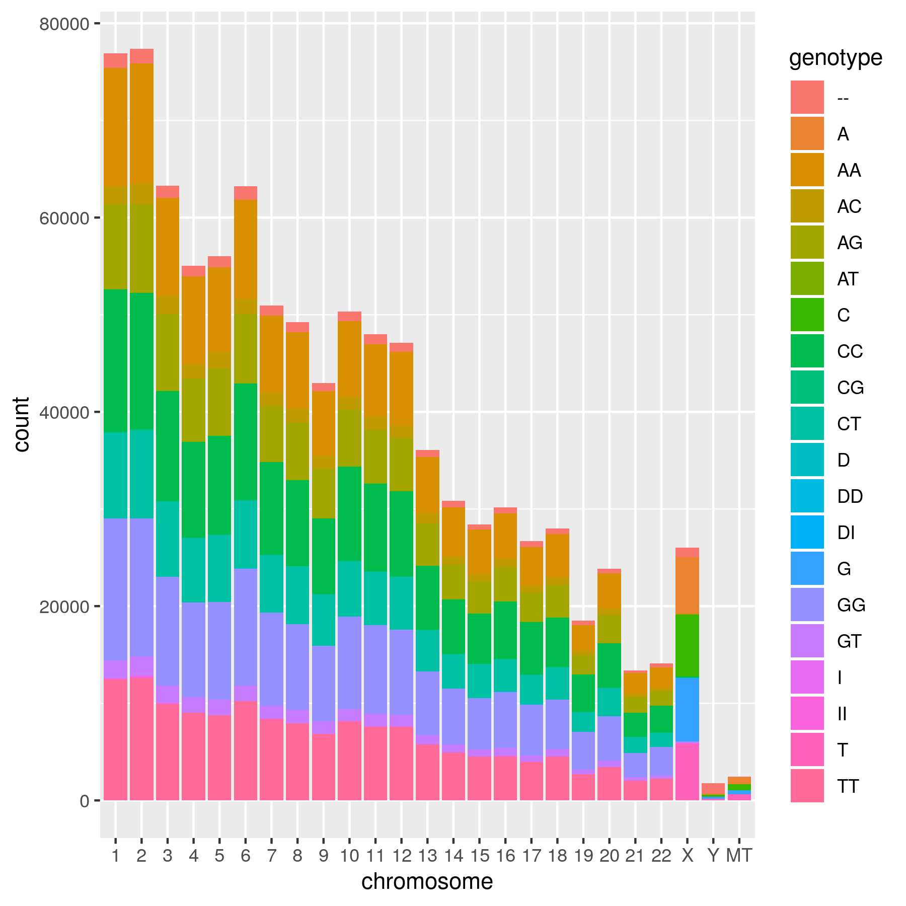

## Learning objectives

### RStudio preferences and keyboard shortcuts

Last week I mentioned some RStudio keyboard shortcuts.

To insert a code chunk use ctr + alt + i 

More can be found in the Menu by clicking on Tools -> Keyboard ShortCuts Help

I don't like to my .Rmd file cluttered by graphs R code outputs outputs. The default inline setting can be changed by clicking on the wheel (next to Knit) and selecting Chunk output in Console. 

### Cleaning up our folders

As the semester goes on your working directory is going to get pretty full. This is a good point to create more structure to the folder. Now let's be consistent in our naming of the files. Rename your lab .R, .Rmd and .html files so that there names are consistent (e.g. lab1.Rmd, lab2.Rmd, lab3.Rmd) across all the labs. Go to your workding directory and create new directories "data", "images" and "old_notesR" (you can do this in RStudion by clicking "New Folder"). Move your 23andMe files into the data folder. Move the image files from last week (png, jpg, etc) in to the image folder. From now on put your data and images in these folders. Put your .R and other notes files in the old_notesR folder.

### Accessing files that are not in your working directory

In the future you will need to change your lines for inputting data and graphs to your .R and .Rmd files by adding the appropriate directory. For example


```{r}
# Importing from your data directory from within your working directory

SNPs<- read.table("data/23andMe_example_cat25.txt", header = TRUE, sep = "\t")
```

and

```{r eval = FALSE}
# Importing from your images directory from within your working directory
# This command is put OUTSIDE the r code chunk

 
```

You can actually access files or images anywhere on your computer if you specify the complete PATH to file. For example the PATH to my working directory for this class is

```{r}
getwd()
```

Thus, I can specify the full path to access this the 23andMefile by appending the data/23andMe_example_cat25.txt to the PATH.  

```{r}
# Importing from your data directory from any location
SNPs<- read.table("/home/jlb/jlb@umass.edu/GoEcology/Courses/583-AdvGen/2020_Spring/GenomeAnalysisR/data/23andMe_example_cat25.txt", header = TRUE, sep = "\t")
```

### Data Carpentries tutorial

So far you have learned different ways in R for subsetting data frames (tables). This week we will build upon those methods using the tidyverse packages.  We will follow a tutorial made and improved by the many people involved with The Data Carpentries - https://datacarpentry.org/R-ecology-lesson/03-dplyr.html  

* We will not be covering the gather() and spread() functions

For this tutorial you will need to download a file from Figshare, a relatively new site for sharing scientific data.  You can do this from within Rstudio using the following lines which will put the file into the data directory you created above. You need to only run this once so I recommend running and then in your lab report setting eval = FALSE in the r code chunk header, so that it is not run when you knit

```{r, eval=FALSE}
 download.file(url="https://ndownloader.figshare.com/files/2292169",
              destfile = "data/portal_data_joined.csv")
```

In the Data Carpentries tutorial be sure to change the path to the data file from data_raw to data

```{r, eval=FALSE}
library (tidyverse)
surveys <- read_csv("data/portal_data_joined.csv")
```


## Exercises

Please include the answers to the Challenge questions from the Data Carpentries tutorial and the below exercises in your Lab Report Hmtl file.  To load your tab deliminated files in tidyverse like the 23andMe file use read_tsv.  Because the 23andMe file contains comments in the first 14 lines, I asked tidyverse to skip them. Also it tries to load chromosome as an integer, but than puts NAs in places where the X, Y and MT should be. Thus, I had to specificy that this column is a factor.

```{r, message = FALSE}
library (tidyverse)
```

```{r}
SNPs <- read_tsv("data/23andMe_complete.txt", skip = 14, col_types = 
  cols(chromosome = col_factor()))
```

Use Pipes when applicable in your code and use the common dplyr functions for the exercises. It is sufficient to show just the 10 lines that are output from the code block (if using pipes)

### Exercise 1

Subset (select) the 23andMe Complete table to just position and genotype

### Exercise 2

Filter to just the MT chromosome and remove genotypes A and T. 

### Exercise 3

Use group_by() and summarize() to find the min positon, max position and total number of positions for each chromosomes. 

### Exercise 4

Building on ex3 create using mutate a new column with the density of SNPs for each chromosome based the total number of SNPs divided by the max position - min position

### Exercise 5

Building on ex3 sort chromosomes based on SNP density.


### Exercise 6

Export the above table as a csv file to your data directory (There will be no results except the code to show me). However you will get an error when knitting if the code is not correct.

