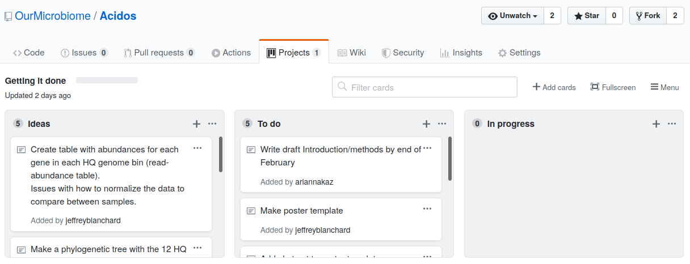

Much of the material for this lesson was borrowed from or inspired by Matt Jones' NCEAS Reproducible Research Techniques for Synthesis workshop](https://learning.nceas.ucsb.edu/2020-02-RRCourse/)

## Learning Objectives

In this lesson, you will learn:

- What computational reproducibility is and why it is useful
- How version control can increase computational reproducibility
- to set up git on your computer
- to use git and github to track changes to your work over time
- How to add references to your report

## Reproducible Research

Reproducibility is the hallmark of science, which is based on empirical observations 
coupled with explanatory models.  While reproducibility encompasses 
the full science lifecycle, and includes issues such as methodological consistency and
treatment of bias, in this course we will focus on **computational reproducibility**: 
the ability to document data, analyses, and models sufficiently for other researchers 
to be able to understand and ideally re-execute the computations that led to 
scientific results and conclusions.

### What is needed for computational reproducibility?

The first step towards addressing these issues is to be able to evaluate the data,
analyses, and models on which conclusions are drawn.  Under current practice, 
this can be difficult because data are typically unavailable, the method sections
of papers do not detail the computational approaches used, and analyses and models
are often conducted in graphical programs, or, when scripted analyses are employed,
the code is not available.

And yet, this is easily remedied.  Researchers can achieve computational 
reproducibility through open science approaches, including straightforward steps 
for archiving data and code openly along with the scientific workflows describing 
the provenance of scientific results (e.g., @hampton_tao_2015, @munafo_manifesto_2017).

### Conceptualizing workflows

Scientific workflows encapsulate all of the steps from data acquisition, cleaning,
transformation, integration, analysis, and visualization.  


Workflows can range in detail from simple flowcharts 
to fully executable scripts. R scripts and python scripts are a textual form 
of a workflow, and when researchers publish specific versions of the scripts and 
data used in an analysis, it becomes far easier to repeat their computations and 
understand the provenance of their conclusions.

### The problem with filenames

Every file in the scientific process changes.  Manuscripts are edited.
Figures get revised.  Code gets fixed when problems are discovered.  Data files
get combined together, then errors are fixed, and then they are split and 
combined again. In the course of a single analysis, one can expect thousands of
changes to files.  And yet, all we use to track this are simplistic *filenames*.  
You might think there is a better way, and you'd be right: __version control__.

Version control systems help you track all of the changes to your files, without
the spaghetti mess that ensues from simple file renaming.  In version control systems
like `git`, the system tracks not just the name of the file, but also its contents,
so that when contents change, it can tell you which pieces went where.  It tracks
which version of a file a new version came from.  So its easy to draw a graph
showing all of the versions of a file, like this one:


Version control systems assign an identifier to every version of every file, and 
track their relationships. They also allow branches in those versions, and merging
those branches back into the main line of work.  They also support having 
*multiple copies* on multiple computers for backup, and for collaboration.
And finally, they let you tag particular versions, such that it is easy to return 
to a set of files exactly as they were when you tagged them.  For example, the 
exact versions of data, code, and narrative that were used when a manuscript was originally 
submitted might be `eco-ms-1` in the graph above, and then when it was revised and resubmitted,
it was done with tag `eco-ms-2`.  A different paper was started and submitted with tag `dens-ms-1`, showing that you can be working on multiple manuscripts with closely related but not identical sets of code and data being used for each, and keep track of it all.

## Version control and Collaboration using Git and GitHub

First, just what are `git` and GitHub?

- __git__: version control software used to track files in a folder (a repository)
    - git creates the versioned history of a repository
- __GitHub__: web site that allows users to store their git repositories and share them with others

### The Git lifecycle

As a git user, you'll need to understand the basic concepts associated with versioned
sets of changes, and how they are stored and moved across repositories.  Any given
git repository can be cloned so that it exist both locally, and remotely.  But each of
these cloned repositories is simply a copy of all of the files and change history
for those files, stored in git's particular format.  For our purposes, we can consider
a git repository just a folder with a bunch of additional version-related metadata.

In a local git-enabled folder, the folder contains a workspace containing the 
current version of all files in the repository. These working files are linked to
a hidden folder containing the 'Local repository', which contains all of the other
changes made to the files, along with the version metadata.

So, when working with files using git, you can use git commands to indicate specifically
which changes to the local working files should be staged for versioning 
(using the `git add` command), and when to record those changes as a version in
the local repository (using the command `git commit`).

The remaining concepts are involved in synchronizing the changes in your local 
repository with changes in a remote repository.  The `git push` command is used to
send local changes up to a remote repository (possibly on GitHub), and the `git pull`
command is used to fetch changes from a remote repository and merge them into the
local repository.


- `git clone`: to copy a whole remote repository to local
- `git add` (stage): notify git to track particular changes
- `git commit`: store those changes as a version
- `git pull`: merge changes from a remote repository to our local repository
- `git push`: copy changes from our local repository to a remote repository
- `git status`: determine the state of all files in the local repository
- `git log`: print the history of changes in a repository

Those seven commands are the majority of what you need to successfully use git.  
But this is all super abstract, so let's explore with some real examples.

### Setting up git on your computer

* Download [git](https://git-scm.com/downloads).
* Go to [github.com](http://github.com) and create an account. 


Before using git, you need to tell it who you are, also known as setting the global options. The only way to do this is through the command line. Newer versions of RStudio have a nice feature where you can open a terminal window in your RStudio session. Do this by selecting Tools -> Terminal -> New Terminal.

A terminal tab should now be open where your console usually is. 

To see if you aleady have your name and email options set, use this command from the terminal:

```{sh git-config, eval=FALSE}
git config --global --list | grep user
```

To set the global options, type the following into the command prompt, with your actual name, and press enter:

```{sh git-name, eval=FALSE}
git config --global user.name "Matt Jones"
```

Next, enter the following line, with the email address you used when you created your account on github.com:

```{sh git-email, eval=FALSE}
git config --global user.email "gitcode@magisa.org"
```

Note that these lines need to be run one at a time.

Finally, check to make sure everything looks correct by entering these commands, which will return the options that you have set.

```{sh git-list, eval=FALSE}
git config --global user.name
git config --global user.email
```

### Note for Windows Users

If you get "command not found" (or similar) when you try these steps through the RStudio terminal tab, you may need to set the type of terminal that gets launched by RStudio. Under some git install senerios, the git executable may not be available to the default terminal type. Follow the instructions on the RStudio site for [Windows specific terminal options](https://support.rstudio.com/hc/en-us/articles/115010737148-Using-the-RStudio-Terminal#appendixe). In particular, you should choose "New Terminals open with Git Bash" in the Terminal options (`Tools->Global Options->Terminal`).

In addition, some versions of windows have difficults with the command line if you are using an account name with spaces in it (such as "Matt Jones", rather than something like "mbjones").  You may need to use an account name without spaces.

### Create a remote repository on GitHub

Let's start by creating a repository on GitHub, then we'll edit some files.

- Log into [GitHub](https://github.com)
- Click the New repository button
- Name it `genome-analysis`
- Create a README.md
- Set the LICENSE to Apache 2.0
- Add a .gitignore file for `R`

You've now created your first repository! It has a couple of files that GitHub created
for you, like the README.md file, and the LICENSE file, and the .gitignore file.


For simple changes to text files, you can make edits right in the GitHub web interface.  For example,
navigate to the `README.md` file in the file listing, and edit it by clicking on the *pencil* icon.
This is a regular Markdown file, so you can just add text, and when done, add a commit message, and 
hit the `Commit changes` button.  


Congratulations, you've now authored your first versioned commit.  If you navigate back to 
the GitHub page for the repository, you'll see your commit listed there, as well as the
rendered README.md file.

Let's point out a few things about this window.  It represents a view of the repository
that you created, showing all of the files in the repository so far.  For each file,
it shows when the file was last modified, and the commit message that was used to last
change each file.  This is why it is important to write good, descriptive commit
messages.  In addition, the blue header above the file listing shows the most recent
commit, along with its commit message, and its SHA identifer.  That SHA identifier is
the key to this set of versioned changes.  If you click on the SHA identifier (*810f314*), 
it will display the set of changes made in that particular commit.

In the next section we'll use the GitHub URL for the GitHub repository you created 
to `clone` the repository onto your local machine so that you can edit the files 
in RStudio.  To do so, start by copying the GitHub URL, which represents the repository
location:

### Working locally with Git via RStudio

RStudio knows how to work with files under version control with Git, but only if
you are working within an RStudio project folder.  In this next section, we will
clone the repository that you created on GitHub into a local repository as an 
RStudio project.  Here's what we're going to do:

- Create the new project
- Inspect the Git tab and version history
- Commit a change to the README.md file
- Commit the changes that RStudio made
- Inspect the version history
- Add and commit an Rmd file
- Push these changes to GitHub
- View the change history on GitHub

__Create a New Project.__ Start by creating a *New Project...* in R Studio, select the *Version Control* 
option, and paste the GitHub URL that you copied into the field for the 
remote repository *Repository URL*.  While you can name the local copy of the 
repository anything, its typical to use the same name as the GitHub repository to
maintain the correspondence.  You can choose any folder for your local copy, in
my case I used 'git-genome-analysis` folder.

Once you hit `Create Project, a new RStudio windo will open with all of the files
from the remote repository copied locally.  Depending on how your version of RStudio
is configured, the location and size of the panes may differ, but they should all
be present, including a *Git* tab and the normal *Files* tab listing the files that 
had been created in the remote repository.

You'll note that there is one new file `genome-analysis.Rproj`, and three files that we
created earlier on GitHub (`.gitignore`, `LICENSE`, and `README.md`).

In the *Git* tab, you'll note that two files are listed.  This is the status pane
that shows the current modification status of all of the files in the repository.
In this case, the `.gitignore` file is listed as *M* for Modified, and `genome-analysis.Rproj` 
is listed with a *? ?* to indicate that the file is untracked.  This means that
git has not stored any versions of this file, and knows nothing about the file.
As you make version control decisions in RStudio, these icons will change to reflect
the current version status of each of the files.

__Inspect the history.__ For now, let's click on the *History* button in the Git tab, which will show the
log of changes that occurred, and will be identical to what we viewed on GitHub.
By clicking on each row of the history, you can see exactly what was added and
changed in each of the two commits in this repository.

__Move your old course files into this new directory.__ Put your .html files into the main directory and delete the html folder.

__Add, Commit and Push the changes (new files) to the Github repo.__ First check the files you want to add. Then click Commit. Write a message to describe the changes (see below on good commit messages.). The Push the changes to the Github repo. Examine the changes in the repo.

### On good commit messages

Clearly, good documentation of what you've done is critical to making the version
history of your repository meaningful and helpful.  Its tempting to skip the 
commit message altogether, or to add some stock blurd like 'Updates'.  Its better
to use messages that will be helpful to your future self in deducing not just what
you did, but why you did it.  Also, commit messaged are best understood if they
follow the active verb convention.  For example, you can see that my commit
messages all started with a past tense verb, and then explained what was changed.

While some of the changes we illustrated here were simple and so easily explained
in a short phrase, for more complext changes, its best to provide a more complete
message.  The convention, however, is to always have a short, terse first sentence, 
followed by a more verbose explanation of the details and rationale for the change.
This keeps the high level details readable in the version log.  I can't count the
number of times I've looked at the commit log from 2, 3, or 10 years prior and
been so grateful for diligence of my past self and collaborators.

### Github project management

You can keep tract of ideas, todos and fixes by creating a wiki or using the Project



### Github web pages

You can enable Github pages to create a web presence for your project. Under the settings tab enable Github pages.  It takes about 10 min for the web site to appear. The default web pages in the README.md file, but if you create and upload an index.html page (from a index.Rmd file) this will be your new default. This provides a way to see the html files in your browser as you intended them to appear (not just the html code).  

### Collaboration and conflict free workflows(we walk talk more about this later in the class)

Up to now, we have been focused on using Git and GitHub for yourself, which is a 
great use. But equally powerful is to share a GitHib repository with other
researchers so that you can work on code, analyses, and models together.  When
working together, you will need to pay careful attention to the state of the 
remote repository to avoid and handle merge conflicts.  A *merge conflict* occurs
when two collaborators make two separate commits that change the same lines of the
same file.  When this happens, git can't merge the changes together automatically,
and will give you back an error asking you to resolve the conflict. Don't be afraid
of merge conflicts, they are pretty easy to handle.  and there are some 
[great](https://help.github.com/articles/resolving-a-merge-conflict-using-the-command-line/) [guides](https://stackoverflow.com/questions/161813/how-to-resolve-merge-conflicts-in-git).

That said, its truly painless if you can avoid merge conflicts in the first place.
You can minimize conflicts by:

- Ensure that you pull down changes just before you commit
  + Ensures that you have the most recent changes
  + But you may have to fix your code if conflict would have occurred
- Coordinate with your collaborators on who is touching which files
  + You still need to comunicate to collaborate

### More with git

There's a lot we haven't covered in this brief tutorial.  There are some great
and longer tutorials that cover additional topics:

* [Happy Git and Github for the useR](https://happygitwithr.com/)
* [Try Git](https://try.github.io) a great interactive tutorial
* Software Carpentry [Version Control with Git](http://swcarpentry.github.io/git-novice/)


## Adding references to your report

You can automatically generate citations and a bibliography in a number of styles. In order to use this feature, you will need to specify a bibliography file using the bibliography metadata field in a YAML metadata section. For example:

---
title: "Sample Document"
output: html_document
bibliography: bibliography.bib
---

The bibliography may have any of these formats:

Format    |File extension
----------|--------------
MODS |.mods
BibLaTeX|.bib
BibTeX|.bibtex
RIS|.ris
EndNote|.enl
EndNote XML|.xml
ISI|.wos
|MEDLINE|.medline
|Copac|.copac
|JSON citeproc|.json

You can export references from your favorite reference manager. I use the open source [Zotero](www.zotero.org).

### Minimum working example

If you create this two files paper.Rmd and references.bib you will have a working example to build from
paper.Rmd

```

---
title: 'My Title'
author: "Me me me me!"
output: html_document
bibliography: data/references.bib
---

Application written in R [@RCoreTeam] using the Shiny framework [@Chang2015].

# REFERENCES
```

references.bib (Make this file as a text file (File -> New File -> text file))

```
@Misc{Chang2015,
  Title                    = {shiny: Web Application Framework for R. R package version 0.12.1},

  Author                   = {Chang, W. and Cheng, J. and Allaire, JJ. and Xie, Y. and McPherson, J. },
  Year                     = {2015},

  Type                     = {Computer Program},
  Url                      = {http://CRAN.R-project.org/package=shiny}
}


@Article{RCoreTeam,
  Title                    = {R: A Language and Environment for Statistical Computing},
  Author                   = {{R Core Team}},
  Year                     = {2015},

  Type                     = {Journal Article},
  Url                      = {http://www.R-project.org}
}
```

Here is a short example of a manuscript style report [Reproducible Papers with RMarkdown](https://nceas.github.io/oss-lessons/reproducible-papers-with-rmd/reproducible-papers-with-rmd.html)

## Exercises

For this lab you will need to create a Github repo and website. The web site should have links to your labs 3-6 and include at least one reference. To complete the assignment on Moodel paste your Github URL into the text box. 

Here is an outline of the steps you should go through today.

1. Download git to your computer
2. Create a personal Github account
3. Create a Github repository "genome-analysis"
4. In your working directory create a project file and paste the URL from the Github repo clone button into the appropriate box
5. Move your course files into the genome-analysis directory. Move your .html files from the html folder to the main directory. Delete the html folder.
6. Add, Commit and Push these changes and files to the Github repo.
7. Create a .Rmd file and name it index.Rmd. The knit version index.html will be your web page.
8. In the index.Rmd file add links to the .html files for lab reports 3-6. 
9. Create a bibiography file and put it in your data folder. Add the line to your YAML block at the beginning of your index.Rmd file.

```
title: "Human Genome Analysis"
author: "Jeffrey Blanchard"
date: "2/26/2020"
output: html_document
bibliography: data/bibliography.bib
```
  
10. Add a reference to your index.Rmd file. Don't forget to include the # REFERENCE block at the end of the file.
11. Knit your index.Rmd file. Test the resulting .html file to make sure the links work.
12. Embellish the index file (web page) with your own personal touches!
13. Add, Commit and Push these changes and files to the Github repo.
14. Check your Github page to make sure all is well.
15. Paste your Github page link into the Moodle Assignment page.


